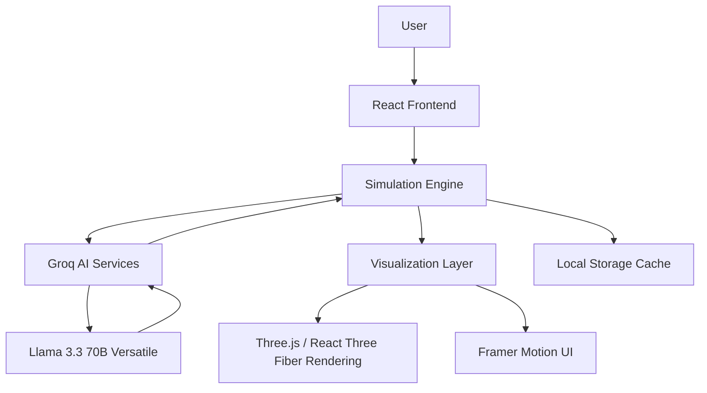
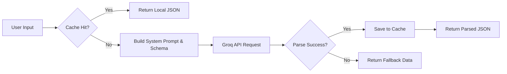

# EcoVerse AI – The Future Earth Simulator

> **"Step into the future your choices create."**

EcoVerse AI is a futuristic, cinematic, AI-powered planetary simulator. It allows users to visualize, simulate, and emotionally connect with the long-term impact of climate policies, sustainability actions, and technological breakthroughs on the future of Earth.


---

## Problem Statement

Climate change is inherently complex. When scientists and policymakers discuss the year 2050 or 2100, the general public struggles to comprehend the sheer scale of long-term impact, policy consequences, and sustainability tradeoffs.

Most climate tools only show raw numbers, bar charts, and static reports. They fail to bridge the emotional gap between *today's actions* and *tomorrow's reality*.

**EcoVerse AI bridges this gap.** By combining advanced Large Language Models with procedurally generated 3D environments, it helps users *visualize* the future rather than just reading about it.

---

## Solution

**EcoVerse AI** is an AI-powered climate simulation platform where users explore alternate futures, simulate environmental decisions, and experience their long-term impact through immersive visual storytelling. 

It translates abstract climate data into visceral, interactive, cinematic experiences. 

---

## Core Philosophy

EcoVerse AI is **not**:
- ❌ A basic carbon calculator
- ❌ A generic sustainability dashboard
- ❌ A daily habit tracker

EcoVerse AI **is**:
- 🌍 **A Future Simulator**
- 🧠 **A Climate Decision Engine**
- 🏙️ **A Planetary Digital Twin**
- 📖 **A Sustainability Storytelling Platform**

---

## Feature Overview

| Feature | Purpose | Technology | AI Usage | Impact |
|---------|---------|------------|----------|--------|
| **Future Earth Portal** | Time-travel portal to alternate futures | R3F, Shaders | Procedural Decades, Narrator | Deep Emotional Connection |
| **Green Multiverse** | Colliding parallel universe simulation | R3F, Particles | Timeline divergence synthesis | "Wow" Factor Demo |
| **Future City Nexus** | 3D living digital twin of a city | R3F, Instancing | AI Mayor insights & policies | Systems Thinking |
| **The Climate Council** | High-stakes UN-style global summit | React, Motion | Multi-Persona Debate Engine | Policy Empathy |
| **Climate Innovation Lab** | Tony Stark-esque startup incubator | R3F, Holograms | Startup DNA & Investor Board | Entrepreneurial Inspiration |
| **FutureCast Network** | Futuristic global news broadcast | R3F, Motion | Live reporting across decades | Real-time History |
| **Planet DNA Lab** | Futuristic archetype sequencer | R3F, Particles | Psychological profiling | Personal Identity |
| **The Great Rewilding** | 3D nature reserve that springs to life | R3F, GLTF | Ecosystem generation | Visual Reward |
| **Future Echoes** | 5-Chapter interactive AI documentary | R3F, Typewriter | Cinematic Storytelling | Historical Perspective |
| **Climate Strategist** | Tactical 3D war room for global strategy | R3F, Motion | Strategy Evaluation | Actionable Intelligence |

---

## Deep Feature Documentation

### The Future Earth Portal
- **What It Does:** The flagship time-travel experience. Users submit a sustainability scenario and watch a massive 3D energy portal tear open. 
- **Why It Matters:** Moving from 2030 to 2100 makes the abstract concept of "long-term climate change" immediately visible and emotionally resonant.
- **User Journey:** Enter Scenario ➔ Portal Spawns ➔ Camera Flies Through ➔ Explore Future Earth ➔ Scrub Decades ➔ Portal Collapses.
- **Technical Implementation:** React Three Fiber, Torus geometries, additive blending, and complex camera `.lerp()` fly-throughs.
- **AI Integration:** Groq generates a massive JSON timeline detailing Earth's physical state, civilization changes, and child generation narratives across 3 decades.
- **Visual Effects Used:** Energy rings, distortion shaders, glowing Earth cores, particle atmospheres.

### Green Multiverse
- **What It Does:** A cinematic 3D experience where users fly through space, entering dimensional portals to alternate Earth futures.
- **Why It Matters:** Demonstrates the fragility of our current timeline by physically showing universes colliding.
- **User Journey:** Select Universes ➔ Fly Through Space ➔ Watch Collision ➔ Read Timeline Synthesis.
- **Technical Implementation:** Multi-scene R3F rendering, massive starfields, and physics-based particle collisions.
- **AI Integration:** Groq synthesizes the physical and societal results of two vastly different timelines colliding into one.
- **Visual Effects Used:** Spatial warping, galaxy generation, high-speed camera transitions.

### Future City Nexus
- **What It Does:** A living, breathing 3D metropolis simulation. Tweak transport and industry policies to watch smog clear, neon buildings light up, and urban forests grow out of the concrete in real-time.
- **Why It Matters:** Replaces boring charts with a SimCity-style digital twin to teach systems-level urban planning.
- **User Journey:** Adjust Policy Sliders ➔ City Transforms ➔ AI Mayor Evaluates.
- **Technical Implementation:** R3F InstancedMeshes (for rendering thousands of buildings at 60fps) and procedural city grids.
- **AI Integration:** Groq acts as the "AI Mayor," generating real-time strategic insights based on slider states.
- **Visual Effects Used:** Bloom, volumetric fog, dynamic lighting, procedural generation.

### The Climate Council
- **What It Does:** A high-stakes global summit. Submit a policy and watch 4 distinct AI personas (Scientist, Economist, Citizen, Strategist) debate it in a 3D Reality Projection chamber.
- **Why It Matters:** Teaches users that climate action is not just science; it's economics, politics, and human sociology.
- **User Journey:** Submit Policy ➔ 3D Chamber Activates ➔ Personas Debate ➔ Final Vote.
- **Technical Implementation:** Framer Motion orchestration synced with 3D R3F floating avatars.
- **AI Integration:** Single Groq request orchestrates 4 unique AI personalities, generating structured arguments and a final UN-style resolution.
- **Visual Effects Used:** Holographic projection rings, floating UI, dramatic interruptions.

### Climate Innovation Lab
- **What It Does:** A futuristic startup incubator. A 3D Innovation Reactor fuses scientific disciplines to generate a holographic climate-tech startup.
- **Why It Matters:** Inspires the next generation of climate-tech founders by showing them billion-dollar solutions to today's crises.
- **User Journey:** Enter Crisis ➔ Reactor Spins Up ➔ Hologram Forms ➔ Review Startup DNA ➔ Launch Globally.
- **Technical Implementation:** R3F multi-stage animations, rotating Icosahedron holograms.
- **AI Integration:** Groq invents the startup, generates technical DNA, and simulates a board of 4 distinct investors critiquing the pitch.
- **Visual Effects Used:** Energy fusion, data sparks, Earth legacy reveal.

### FutureCast Network
- **What It Does:** A live television broadcast from tomorrow. Submit a scenario and watch a 3D Holographic News Globe react as you scrub through a chronological timeline of breaking news.
- **Why It Matters:** Grounding the future in the familiar format of a news broadcast makes the science feel imminent and real.
- **User Journey:** Connect Uplink ➔ Globe Spins ➔ Breaking News Flashes ➔ Switch Channels ➔ Fast Forward Decade.
- **Technical Implementation:** R3F globe paired with complex Framer Motion UI overlays and AnimatePresence state machines.
- **AI Integration:** Groq writes the news anchor script, field reports for 3 distinct channels, and citizen interviews for 3 different decades in one massive JSON payload.
- **Visual Effects Used:** Wireframe globes, orbital data rings, typewriter text.

---

## System Architecture



- **React Frontend**: Manages routing, global state, and user interactions.
- **Simulation Engine**: Acts as the orchestrator, determining when to fire API calls and when to update the global `SimulationContext` (Health Score, Impact Stats).
- **Groq AI Services**: The intelligence layer. Processes complex prompts and forces structured JSON outputs.
- **Visualization Layer**: Translates JSON data into visual parameters (colors, particle counts, animation speeds).
- **Three.js Rendering**: Executes the WebGL rendering loop.
- **Local Storage Cache**: Ensures that previously generated timelines are cached instantly to avoid API costs and latency.

---

## Frontend Architecture

- **React Components**: Modular, functional components using Hooks.
- **Pages**: Top-level route wrappers.
- **Feature Modules**: Self-contained components housing specific logic (e.g., `ClimateNews.jsx`).
- **Three.js Scenes**: Decoupled `Canvas` components (e.g., `FutureCastScene.jsx`) injected into Feature Modules to separate UI from WebGL logic.
- **Animation System**: Framer Motion handles all 2D DOM animations (`AnimatePresence`, `motion.div`).
- **State Management**: React Context API (`SimulationContext`) for global variables like Planet Health.
- **Routing**: React Router DOM.
- **Local Storage**: Custom caching utility mapping prompt signatures to JSON payloads.

### Folder Structure
```
src/
├── components/
│   ├── Features/       # All cinematic AI features & R3F Scenes
│   ├── layout/         # Sidebar, Layout wrappers
│   └── ui/             # Reusable UI elements (if any)
├── context/
│   └── SimulationContext.jsx  # Global state manager
├── services/
│   └── ai.js           # Groq API client & JSON schema parsing
├── App.jsx             # Router definition
└── main.jsx            # Entry point
```

---

## AI Architecture

- **Provider**: Groq (Chosen for ultra-low latency LPU inference).
- **Model**: `llama-3.3-70b-versatile` (Chosen for high reasoning capability and strict JSON adherence).
- **Prompt Engineering**: System prompts are highly specific, establishing a persona (e.g., "You are the AI Mayor", "You are the FutureCast Network Core") and enforcing strict JSON output structures.
- **Single Request Multi-Persona System**: Instead of chaining multiple API calls (which causes UI blocking), a single complex JSON schema is requested, forcing the LLM to generate all personas, timelines, and statistics in one pass.
- **Caching Strategy**: Every request is hashed by a `cacheKey`. If it exists in `localStorage`, the API is bypassed, resulting in 0ms latency.
- **Fallback Mechanisms**: If the LLM returns malformed JSON or the rate limit is hit, the application gracefully falls back to a hardcoded, cinematic default response to preserve the user experience.



---

## Data Flow

1. **User Action**: The user inputs a scenario (e.g., "Ban plastic").
2. **Simulation Engine**: Triggers the `loading` state, rendering the cinematic "spinning up" animations (e.g., Portal Stabilizing, Reactor Charging).
3. **AI Analysis**: `ai.js` fetches the timeline data from Groq.
4. **Visualization Layer**: The React component parses the JSON. If `earthState.color` is returned as `#00ffcc`, it updates the React state.
5. **UI Rendering**: The `Canvas` component receives the new color as a prop and instantly interpolates the WebGL materials to the new visual state.

---

## Visualization Engine

- **Three.js & React Three Fiber**: The backbone of the 3D experience. Allows declarative WebGL inside React.
- **Particle Systems**: Utilized via `@react-three/drei`'s `<Sparkles>` and custom instanced meshes to represent pollution, fireflies, and data streams.
- **Portal Effects**: Created using rotating Torus geometries, additive blending, and point lights.
- **Reality Morphing**: Animated by interpolating camera positions (`lerp`) and material colors over the `useFrame` render loop.
- **Environmental Transformations**: Procedural generation (e.g., placing trees on a grid, instancing city buildings).
- **Camera Flythroughs**: Handled natively in R3F by updating `camera.position` and `camera.lookAt` dynamically based on the current UI "stage".

---

## Sustainability Simulation Engine

The engine relies on the LLM's vast knowledge base to project realistic outcomes.
When a user inputs: *“100% EV Transition”*, the prompt instructs the model to evaluate the systemic impacts. 
The LLM considers:
- Infrastructure costs (grid upgrades).
- Raw material bottlenecks (lithium mining).
- Societal benefits (air quality, noise reduction).
It then returns these qualitative and quantitative projections structured into our expected JSON format, which the `SimulationContext` consumes to update the global **Planet Health Score**.

---

## Technology Stack

| Category | Technology |
|----------|------------|
| **Frontend Core** | React 18, Vite |
| **AI Provider** | Groq (Llama 3.3 70B) |
| **3D Rendering** | Three.js, React Three Fiber, Drei |
| **2D Animation** | Framer Motion |
| **Styling** | Tailwind CSS |
| **Icons** | Lucide React |
| **Routing** | React Router DOM |
| **Deployment** | Vercel (Recommended) |

---

## Performance Optimizations

- **Instanced Meshes**: In the `Future City Nexus`, instead of rendering 5,000 individual building geometries (which would crash the browser), we use a single `InstancedMesh`. This allows the GPU to render the entire city in a single draw call.
- **Lazy Loading & Suspense**: 3D assets and R3F canvases are wrapped in `<React.Suspense>` to prevent blocking the main UI thread during load.
- **Aggressive Local Caching**: LLM responses are heavily cached. This reduces API costs to zero for repeat visits and drops generation latency from ~3000ms to 0ms.
- **Single-Pass LLM Requests**: Combining massive schemas into one API call rather than chaining multiple smaller calls.

---

## Security Considerations

- **Frontend-Only Architecture**: This app runs entirely in the browser.
- **Environment Variables**: The `VITE_GROQ_API_KEY` must be supplied. In production, requests should ideally be proxied through a lightweight backend or serverless function to hide the API key, though for hackathon/demo purposes, it can be provided locally.
- **Rate Limits**: Graceful error handling ensures the app doesn't crash if the Groq API rate limit is exceeded.

---

## Installation Guide

1. **Clone the repository:**
   ```bash
   git clone https://github.com/poorvishetty193/EcoLens-Pro.git
   cd EcoLens-Pro
   ```

2. **Install dependencies:**
   ```bash
   npm install
   ```

3. **Set up Environment Variables:**
   Create a `.env` file in the root directory and add your Groq API key:
   ```env
   VITE_GROQ_API_KEY=your_groq_api_key_here
   ```

4. **Run the development server:**
   ```bash
   npm run dev
   ```

5. **Build for production:**
   ```bash
   npm run build
   ```

---

## Deployment Guide

Deploying to **Vercel** is highly recommended for Vite/React applications.

1. Push your code to GitHub.
2. Log in to Vercel and click **Add New Project**.
3. Import your `EcoLens-Pro` repository.
4. **CRITICAL:** Under *Environment Variables*, add `VITE_GROQ_API_KEY` and your key.
5. Click **Deploy**. Vercel will automatically detect the Vite build settings (`npm run build`, `dist` folder) and publish the site.

---

## Innovation Highlights

What makes **EcoVerse AI** unique compared to other climate tech tools?

- **Zero Dashboards**: We removed almost all traditional charts and bar graphs, replacing them with visceral 3D simulations.
- **The Future Earth Portal**: A completely novel way to experience long-term data via a simulated 3D time machine.
- **The Climate Council**: Pioneering multi-agent AI debates where personas interrupt and argue with each other before voting on your policy.
- **Planet DNA Lab**: Turning sustainability into a highly personal psychological archetype, making users care about their "environmental identity."
- **Procedural Visualization**: Connecting LLM JSON outputs directly to WebGL shader parameters and particle systems.

---

## Future Roadmap

- **Phase 1 (Current):** Establish the core cinematic simulation engine and multi-persona AI integrations.
- **Phase 2:** Integrate real-time API data (e.g., live AQI, global deforestation rates) to drive the base state of the 3D planet before simulations begin.
- **Phase 3:** Introduce a "Multiplayer Multiverse" where the policy decisions of different users around the world actively compete and merge in a shared global simulation.
- **Future Vision:** Evolve EcoVerse AI from a simulation platform into a certified educational tool deployed in universities to train the next generation of climate strategists.

---

## Author

**Poorvi Shetty**  
*AI & Full Stack Developer*

This project was architected, designed, and developed to push the boundaries of what is possible at the intersection of generative AI, WebGL, and climate technology. 

---

## Acknowledgements

- **Groq** for providing the blisteringly fast LPU inference required for real-time generative simulations.
- **Poimandres (pmndrs)** for the incredible `react-three-fiber` and `drei` ecosystems.
- **Framer** for the seamless UI animation library.
- Inspired by the urgent need for better, more emotional climate communication tools.
